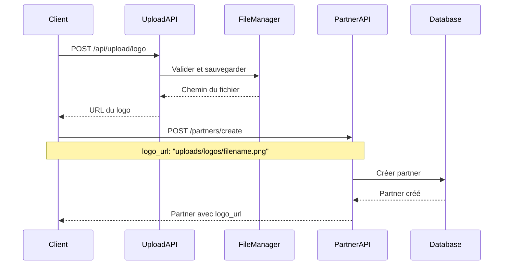
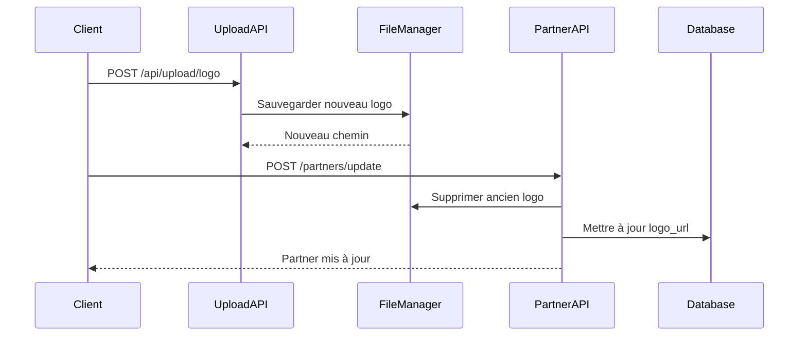
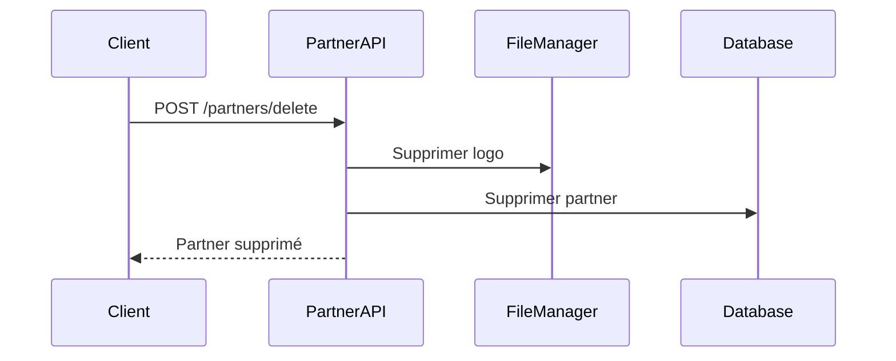

# 🖼️ Gestion des Logos

## 📋 Vue d'ensemble

Le système de gestion des logos permet d'uploader, stocker et gérer les logos des partners de manière sécurisée et organisée.

## 🏗️ Architecture

### Composants principaux

1. **FileUploadManager** (`utils/file_upload.py`)
   - Gestionnaire principal des uploads de fichiers
   - Validation des types de fichiers
   - Génération de noms uniques
   - Gestion des chemins et URLs

2. **Routes d'upload** (`routes/file_upload.py`)
   - Endpoints pour l'upload de logos
   - Endpoints pour la suppression de fichiers
   - Service des fichiers statiques

3. **Service Partner** (`services/partner_service.py`)
   - Intégration automatique avec la gestion des logos
   - Suppression automatique des anciens logos
   - Gestion des chemins de fichiers

## 🔧 Configuration

### Structure des dossiers

```
src/
├── uploads/
│   ├── logos/          # Logos des partners
│   ├── files/          # Autres fichiers
│   └── ...
```

### Types de fichiers autorisés

- **Images** : PNG, JPG, JPEG, GIF, SVG, WEBP
- **Taille maximale** : 5MB
- **Validation** : Type MIME et extension

## 📚 API Endpoints

### 1. Upload de logo
```http
POST /api/upload/logo
Content-Type: multipart/form-data

file: [fichier image]
```

**Réponse :**
```json
{
  "status": "success",
  "message": "Logo uploadé avec succès",
  "data": {
    "file_path": "uploads/logos/20250812_213000_uuid.png",
    "file_url": "http://localhost:8081/api/upload/uploads/logos/20250812_213000_uuid.png",
    "filename": "20250812_213000_uuid.png"
  }
}
```

### 2. Upload générique
```http
POST /api/upload/file
Content-Type: multipart/form-data

file: [fichier]
subfolder: [sous-dossier optionnel]
```

### 3. Suppression de fichier
```http
POST /api/upload/delete
Content-Type: application/json

{
  "file_path": "uploads/logos/filename.png"
}
```

### 4. Accès aux fichiers
```http
GET /api/upload/uploads/logos/filename.png
```

## 🔄 Flux de gestion des logos

### 1. Création d'un partner avec logo


### 2. Mise à jour d'un logo


### 3. Suppression d'un partner


## 🛠️ Utilisation dans le code

### Upload de logo
```python
from utils.file_upload import file_upload_manager

# Upload d'un logo
success, message, file_path = file_upload_manager.save_file(
    file, 
    subfolder='logos'
)

if success:
    logo_url = file_upload_manager.get_file_url(file_path)
    # Utiliser logo_url dans la base de données
```

### Validation de fichier
```python
is_valid, message = file_upload_manager.validate_image_file(file)
if not is_valid:
    return {"error": message}
```

### Suppression de fichier
```python
success = file_upload_manager.delete_file(file_path)
```

## 🔒 Sécurité

### Fonctionnalités de sécurité

1. **Validation des types** : Seuls les fichiers image sont acceptés
2. **Validation de taille** : Limite de 5MB par fichier
3. **Noms sécurisés** : Génération de noms uniques avec timestamp
4. **Nettoyage automatique** : Suppression des anciens fichiers
5. **Validation MIME** : Vérification du type de contenu

### Bonnes pratiques

1. **Toujours valider** les fichiers avant l'upload
2. **Nettoyer les anciens fichiers** lors des mises à jour
3. **Utiliser des sous-dossiers** pour organiser les fichiers
4. **Limiter les types** de fichiers autorisés
5. **Monitorer l'espace disque** utilisé

## 🧪 Tests

### Test manuel
```bash
# Upload de logo
curl -X POST http://localhost:8081/api/upload/logo \
  -F "file=@logo.png"

# Créer un partner avec le logo
curl -X POST http://localhost:8081/partners/create \
  -H "Content-Type: application/json" \
  -d '{
    "user": {"id": 1},
    "datas": [{
      "name": "TechCorp",
      "logo_url": "uploads/logos/filename.png"
    }]
  }'
```

### Test automatique
```bash
python test_logo_upload.py
```

## 📊 Monitoring

### Métriques importantes

1. **Espace disque** : Taille du dossier uploads
2. **Nombre de fichiers** : Logos stockés
3. **Taux d'erreur** : Échecs d'upload
4. **Performance** : Temps de réponse des uploads

### Logs utiles

```python
# Dans les logs
logger.info(f"Logo uploadé: {file_path}")
logger.info(f"Ancien logo supprimé: {old_logo_path}")
logger.error(f"Erreur d'upload: {error}")
```

## 🚨 Dépannage

### Problèmes courants

1. **Fichier trop volumineux**
   - Vérifier la limite de 5MB
   - Compresser l'image si nécessaire

2. **Type de fichier non autorisé**
   - Vérifier l'extension (.png, .jpg, etc.)
   - Convertir le fichier si nécessaire

3. **Erreur de permissions**
   - Vérifier les droits d'écriture sur le dossier uploads
   - Créer le dossier s'il n'existe pas

4. **URL de fichier incorrecte**
   - Vérifier la configuration BASE_URL
   - Vérifier le chemin relatif du fichier

### Commandes de diagnostic

```bash
# Vérifier l'espace disque
du -sh uploads/

# Lister les logos
ls -la uploads/logos/

# Vérifier les permissions
ls -la uploads/

# Tester l'accès à un fichier
curl -I http://localhost:8081/api/upload/uploads/logos/filename.png
```

## 🔄 Évolutions futures

### Améliorations possibles

1. **Redimensionnement automatique** : Créer des thumbnails
2. **Optimisation d'images** : Compression automatique
3. **Stockage cloud** : AWS S3, Google Cloud Storage
4. **CDN** : Distribution de contenu
5. **Watermarking** : Ajout de marques d'eau
6. **Backup automatique** : Sauvegarde des logos

### Intégrations

1. **AWS S3** : Stockage cloud
2. **Cloudinary** : Gestion d'images avancée
3. **ImageMagick** : Traitement d'images
4. **Redis** : Cache des URLs
5. **Monitoring** : Prometheus/Grafana 