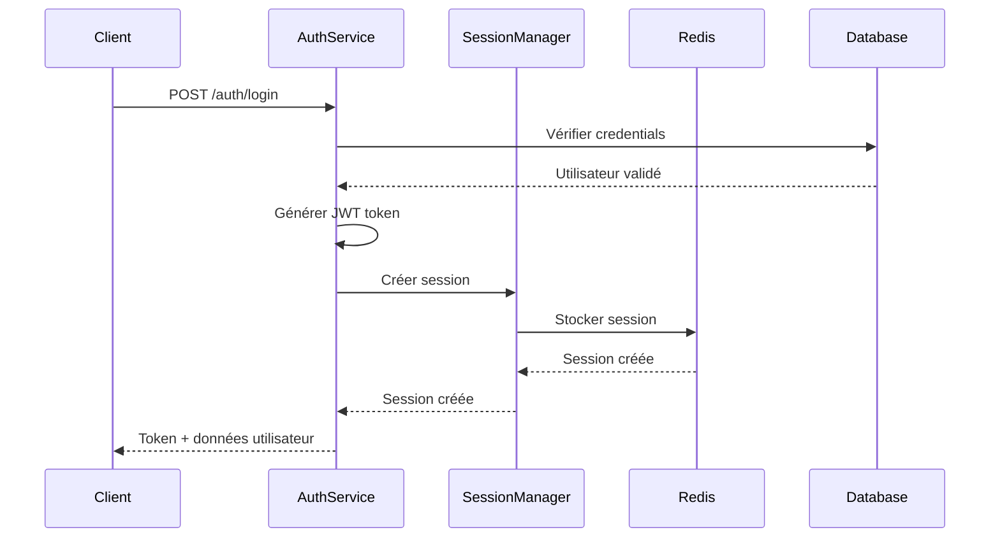
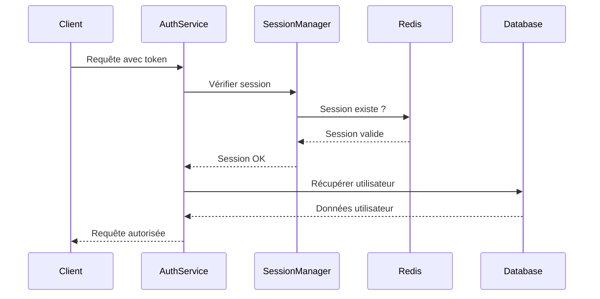
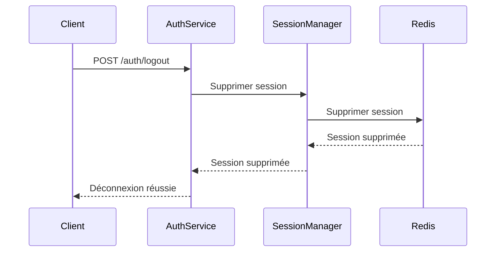

# 🔐 Gestion des Sessions avec Redis

## 📋 Vue d'ensemble

Le système de gestion des sessions utilise **Redis** pour stocker les sessions utilisateur de manière sécurisée et performante. Chaque session est associée à un token JWT et expire automatiquement après 2 heures.

## 🏗️ Architecture

### Composants principaux

1. **SessionManager** (`utils/session_utils.py`)
   - Gestionnaire principal des sessions Redis
   - Connexion automatique à Redis
   - Gestion des sessions avec TTL

2. **AuthService** (`services/auth_service.py`)
   - Intégration avec le système d'authentification
   - Création/suppression automatique des sessions
   - Validation des tokens avec vérification de session

3. **Routes de session** (`routes/session_routes.py`)
   - Endpoints pour le monitoring et l'administration
   - Vérification de la santé du système

## 🔧 Configuration

### Variables d'environnement requises

```bash
# Redis Configuration
REDIS_HOST=localhost
REDIS_PORT=6379
REDIS_DB=0
REDIS_PASSWORD=  # Optionnel
```

### Installation des dépendances

```bash
pip install redis
```

## 📚 API Endpoints

### 1. Vérification de santé
```http
GET /api/sessions/health
```

**Réponse :**
```json
{
  "message": "État du système de sessions",
  "redis_status": "✅ Connecté",
  "session_manager_ready": true
}
```

### 2. Statistiques des sessions
```http
GET /api/sessions/stats
```

**Réponse :**
```json
{
  "message": "Statistiques des sessions",
  "stats": {
    "redis_connected": true,
    "status": "Système opérationnel"
  }
}
```

## 🔄 Flux d'authentification

### 1. Connexion (Login)


### 2. Validation de token


### 3. Déconnexion (Logout)


## 🛠️ Utilisation dans le code

### Création d'une session
```python
from utils.session_utils import create_user_session

# Lors du login
user_data = {
    'id': user.id,
    'email': user.email,
    'name': user.name,
    'role_name': user.role.name
}

success = create_user_session(
    user_id=user.id,
    user_data=user_data,
    token=token
)
```

### Vérification d'une session
```python
from utils.session_utils import is_user_session_valid

# Vérifier si une session est valide
is_valid = is_user_session_valid(token)
```

### Suppression d'une session
```python
from utils.session_utils import delete_user_session

# Lors du logout
success = delete_user_session(token)
```

## 🔒 Sécurité

### Fonctionnalités de sécurité

1. **Expiration automatique** : Sessions expirées après 2 heures
2. **Validation double** : JWT + Session Redis
3. **Suppression immédiate** : Sessions supprimées lors du logout
4. **Isolation** : Chaque session est indépendante

### Bonnes pratiques

1. **Toujours vérifier la session** avant d'autoriser l'accès
2. **Supprimer les sessions** lors du logout
3. **Utiliser HTTPS** en production
4. **Monitorer Redis** pour détecter les problèmes

## 🧪 Tests

### Test manuel
```bash
# Démarrer l'application
python run.py

# Dans un autre terminal
python test_sessions.py
```

### Test des endpoints
```bash
# Vérifier la santé
curl http://localhost:5000/api/sessions/health

# Obtenir les stats
curl http://localhost:5000/api/sessions/stats
```

## 📊 Monitoring

### Métriques importantes

1. **Connexions Redis** : Vérifier la connectivité
2. **Sessions actives** : Nombre de sessions en cours
3. **Taux d'erreur** : Sessions invalides
4. **Performance** : Temps de réponse Redis

### Logs utiles

```python
# Dans les logs
logger.info("✅ Session créée pour l'utilisateur {user_id}")
logger.info("✅ Session supprimée pour le token {token}")
logger.error("❌ Erreur de connexion Redis: {error}")
```

## 🚨 Dépannage

### Problèmes courants

1. **Redis non connecté**
   - Vérifier que Redis est démarré
   - Vérifier les paramètres de connexion
   - Vérifier les logs d'erreur

2. **Sessions expirées trop rapidement**
   - Vérifier le TTL configuré
   - Vérifier l'heure système

3. **Erreurs de validation**
   - Vérifier que les sessions sont créées
   - Vérifier la cohérence JWT/Redis

### Commandes de diagnostic

```bash
# Vérifier Redis
redis-cli ping

# Lister les sessions
redis-cli keys "session:*"

# Vérifier la configuration
python -c "from utils.session_utils import session_manager; print(session_manager.redis_client.ping())"
```

## 🔄 Évolutions futures

### Améliorations possibles

1. **Refresh tokens** : Renouvellement automatique des sessions
2. **Sessions multiples** : Support de plusieurs sessions par utilisateur
3. **Géolocalisation** : Traçage des connexions par IP
4. **Notifications** : Alertes sur les connexions suspectes
5. **Backup** : Sauvegarde des sessions critiques

### Intégrations

1. **Monitoring** : Prometheus/Grafana
2. **Alerting** : Notifications sur les pannes
3. **Analytics** : Statistiques d'utilisation
4. **Audit** : Logs détaillés des sessions 